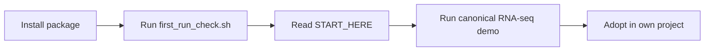
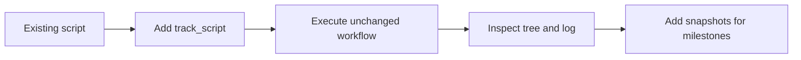
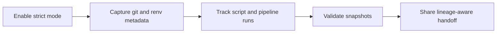
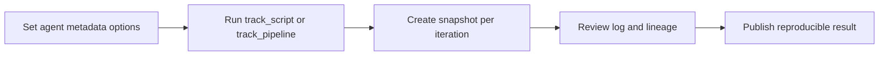

# User Journeys

This page gives visual, role-based paths for adopting OmicsLake.

## Journey A: First-time analyst



## Journey B: Existing pipeline owner



## Journey C: Team reproducibility lead



## Journey D: AI-assisted coding workflow



## Commands used across journeys

```bash
bash tools/first_run_check.sh
bash tools/run_demo_count_edger_limma_voom_ora.sh
```
